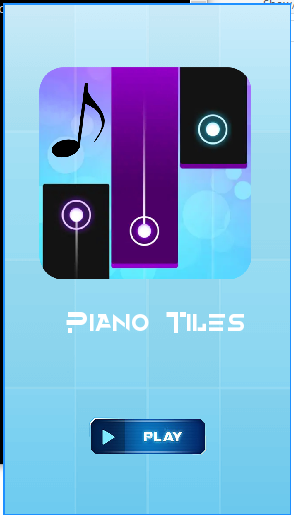

**Melody Tiles** is a musical game inspired by piano tiles, implemented in Python using Pygame.

<p align='center'>
	
</p>

### Requirements

To install the required packages, use the package manager [pip](https://pip.pypa.io/en/stable/):

- Pygame

```bash
pip install pygame
```

### Usage

To start the game, double-click `game.py`. Once the game opens, click "Start" to begin playing. The goal is to click on the tiles as they appear to produce musical notes. Be careful not to click outside the tiles or let any tile reach the bottom of the screen unclicked, as this will end the game.

Controls:
- Use mouse movement to navigate and the left mouse button to click on the tiles.

### Contributing

Pull requests are welcome. For significant changes, please open an issue first to discuss your ideas.

Ensure that you update tests as needed.